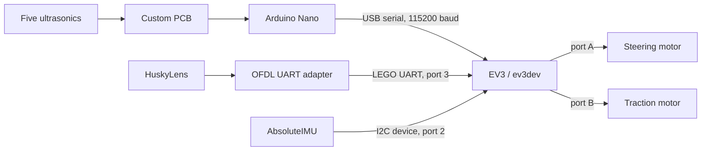

<div align="center">

# LOS GRISES JR

**World Robot Olympiad 2026**  
**Future Engineers**  
**Mexico**


</div>

Los Grises Jr built this autonomous vehicle for WRO 2026 Future Engineers. This repository records the robot we assembled, the programs currently in use, the tests that changed our decisions, and the parts of the design that still need measurement.

## Robot presentation

The vehicle is a LEGO-based four-wheel car with Ackermann steering and rear-wheel drive through a LEGO differential. A LEGO Mindstorms EV3 running ev3dev executes the autonomous behavior. An Arduino Nano acquires five ultrasonic sensors, while a HuskyLens supplies visual pillar information and a mindsensors AbsoluteIMU supplies angular information. A custom PCB organizes the Nano and ultrasonic connections.

We did not make a major redesign of the main mechanism during this development period. Most of our work was integration: making the existing mechanical platform, sensors, electronics and control code behave as one system.

## About the robot

| Component | Quantity | Function |
|:---|:---:|:---|
| LEGO Mindstorms EV3 | 1 | Main controller running ev3dev and Python |
| EV3 Medium Motor | 2 | One traction motor and one steering motor |
| Arduino Nano | 1 | Acquisition hub for five ultrasonic sensors |
| HC-SR04 ultrasonic sensor | 5 | Lateral distance, corner anticipation and frontal safety |
| HuskyLens with OFDL adapter | 1 | Learned-color pillar detection over LEGO UART |
| mindsensors AbsoluteIMU | 1 | Angular velocity, integrated heading and corner counting |
| Custom PCB | 1 | Nano mounting, sensor routing and documented power connections |
| LEGO gears and differential | — | Transmission and different rear-wheel speeds in a turn |

The exact motor-to-wheel gear ratio and tooth counts have not been measured. We therefore describe speed values as software command percentages and do not convert them into a verified physical vehicle speed.

## Robot photos

These six views document the completed vehicle from every required side.

| Front | Top | Right |
|:---:|:---:|:---:|
|  |  |  |

| Left | Rear | Bottom |
|:---:|:---:|:---:|
|  |  |  |

The same views are collected in [Vehicle Photos](Photos/Vehicle-Photos.md) for direct reference.

## Competition videos

| Open Challenge | Obstacle Challenge |
|:---:|:---:|
| [Watch the Open Challenge run](https://youtu.be/L_cxqAxT0rg) | [Watch the Obstacle Challenge run](https://youtu.be/ZGV2QgN1YLQ) |

## System and robot architecture

The EV3 owns the high-level loop: it reads sensor state, calculates steering, commands traction, integrates angular motion, counts corners and stops the run. The Nano keeps repetitive ultrasonic timing away from that loop. The HuskyLens is used where color and pillar position matter; the AbsoluteIMU provides information wall distance alone cannot provide.

| Subsystem | Component | Purpose | Current interface |
|:---|:---|:---|:---|
| Main control | EV3 with ev3dev | Autonomous decisions and motor commands | Python/ev3dev |
| Distance acquisition | Arduino Nano | Read five ultrasonics and publish framed data | USB serial, 115200 baud |
| Vision | HuskyLens + OFDL adapter | Pillar ID and bounding box | LEGO UART, sensor port 3 |
| Heading | AbsoluteIMU | Gyroscope data and integrated angle | I2C device, sensor port 2 |
| Steering | EV3 Medium Motor | Encoder-position steering | Motor port A |
| Traction | EV3 Medium Motor | Encoder-regulated drive | Motor port B |
| Nano supply | EV3 output and converter | Current code's Nano power path | Motor port D; USB carries data |
| Sensor routing | Custom PCB | Nano and ultrasonic connection organization | Trig/echo and I2C-related connections |

Earlier firmware used I2C at address `0x08`: first one byte per request, then an eight-byte packet with validity mask, frame counter and XOR checksum. The final configuration selects `ARD_BACKEND = 'serial'` and [ultrasonic_hub_serial.ino](Src/arduino_nano/ultrasonic_hub_serial.ino), which streams ASCII frames over USB at 115200 baud. These are different architectures; USB serial is not “I2C by USB.” The migration is recorded in the [Engineering Journal](docs/Engineering%20Journal.md), and the older frame is documented in [PROTOCOLO_I2C_MULTIPLEXOR.md](docs/PROTOCOLO_I2C_MULTIPLEXOR.md).



## Mechanical design

The chassis uses LEGO elements. Its front wheels use Ackermann steering: in a turn, the inner wheel follows a smaller radius than the outer wheel, so the linkage gives them different steering paths. The rear LEGO differential serves the same geometric need at the driven axle by allowing the two driven wheels to rotate at different speeds.

Both traction and steering use EV3 Medium Motors. The transmission uses LEGO gears, but the repository has no verified reduction or gear-tooth inventory. The diagnostic `python3 check_hw.py reduccion` is the intended measurement procedure before any ground-speed claim.

The primary physical build document for the current competition robot is [Los Grises Jr.pdf](Los%20Grises%20Jr.pdf). Inspection confirms that it contains 66 numbered, illustrated LEGO assembly pages for this model. [modelo lego_11_07_58_copy-1.pdf](modelo%20lego_11_07_58_copy-1.pdf) documents a different, previous robot version and should not be used as the current competition build. Supporting files include the [port and component list](mechanic/List%20of%20ports%20and%20components.md) and printable [double ultrasonic mount](mechanic/PORTA%20ULTRA%20DOBLE%20%281%29.stl).

The component list records 861 g mass, 24 × 23 × 18 cm overall dimensions and 56.0 mm driven-wheel diameter. Its wheelbase and track-width values are questioned by the [Control Model](docs/Control_Model.md), so we do not present them as verified chassis measurements.

## Electronics and power

The EV3 battery is the energy source. The motors run from the EV3, the sensors connect through the EV3/Nano architecture, and current source configuration drives port D continuously for the Nano power path while USB carries Nano data. The code requires 100% duty because a lower output would be switched rather than continuous. This is a command architecture, not a component current measurement.

Battery state became a control variable: identical commands did not always produce identical achieved response as the battery changed. We charge before testing and begin comparable tuning runs from a consistent condition. Battery state affects motor response, which changes steering timing and the apparent quality of a gain. No component-by-component current or power budget is documented.

## Sensor architecture

The five-sensor layout is verified in the Nano pin map and `wro/config.py`. The diagonal sensors are approximately 25° in the current repository, although an older tuning note says 45°.

| Sensor | Orientation | Trig/echo | Main purpose |
|:---|:---:|:---:|:---|
| Left side | 90° | 11 / 12 | Perpendicular distance to left wall |
| Left diagonal | 25° | 9 / 10 | Earlier wall/corner information |
| Front | Forward | 7 / 8 | Corner anticipation and frontal safety |
| Right diagonal | 25° | 5 / 6 | Earlier wall/corner information |
| Right side | 90° | 3 / 4 | Perpendicular distance to right wall |

The side pairs provide lateral information, the diagonal views add anticipation, and the front measurement prevents a symmetric side error from hiding a wall directly ahead. Sensor heights and exact chassis coordinates are not documented.

Each serial line contains five distances, a validity mask, frame counter and XOR checksum. Missing echo is a sentinel plus a cleared validity bit, not a distance. On EV3, a short dropout holds the last good reading, a median-of-three rejects isolated spikes, and a longer side dropout can be estimated from its partner using the 25° geometry. The front uses a cautious extended hold because a close or oblique wall can also produce no echo. Run telemetry exposes substitution, partner-estimate, failed-read and malformed-frame counters.

One right-side ultrasonic failed continuously. Its fallback created an error near +62 and led us to raise gain to compensate. After repair, the real error was smaller and the excessive gain saturated steering. A later run recorded 777 missing echoes in 3,483 frames for one diagonal sensor. Filtering can keep a run alive, but it cannot turn a hardware fault into trustworthy measurement.

## Custom PCB

<div align="center">
  
</div>

Paulina designed the custom PCB in EasyEDA. The available [PCB design documentation](Electronics/PCB%20design.md) shows a Nano-centered board with screw-terminal input, JST connections, labeled input/output connections, enable pads, mounting holes and an optional I2C header. We use it to organize the ultrasonic and Nano connections.

The repository contains the description and board image, but no editable EasyEDA project, schematic, Gerbers or pin-by-pin wiring diagram. We therefore do not infer regulation behavior or electrical limits from visual labels. One Arduino Nano lacked a working bootloader and was replaced after a borrowed Nano verified that software was not the cause.

## HuskyLens vision

The elevated HuskyLens observes learned-color pillars; its exact mounting height is not documented. It connects at sensor port 3 through an OFDL adapter translating camera output to LEGO UART. EV3 reads one atomic 32-byte block containing eight values. This replaced eight separate reads taking 49 ms; the block read measured 5 ms and cannot mix two frames.

At startup, a `HuskyLens` object clears stored detection and hold values, reads the sensor and reports readiness. The measured order is `X, Y, W, H, ID, State` plus two unused values. Current learned IDs are red = 1 and green = 2.

Red is targeted so the robot passes on the right; green so it passes on the left. A 0.15 s hold covers one-to-three-loop losses. When two pillars alternate, code keeps the current target unless the new box is at least 20% wider; because pillars are equal size, width is the available proximity clue. A 0.3 s hold increased stale commands from 12% to 31% of loops without fixing switching, so dropout hold and target selection were separated.

## AbsoluteIMU

The AbsoluteIMU is mounted on one side and connected at sensor port 2. The driver reads Z angular velocity, averages 600 stationary samples for zero offset, applies a 0.3°/s dead band and integrates actual elapsed time. Accumulated angle is reset immediately before a run so setup movement does not contaminate the first corner.

A corner is recognized at 87°, slightly below ideal 90° to cover small undershoot from dead band and discrete integration. Twelve accepted corners represent three laps. Avoidance once produced two apparent corners 1.1 s apart while real corners were about 6 s apart. Code rejects events closer than 1.5 s and still resets angle so rejected rotation cannot trigger the next corner early. See the [AbsoluteIMU notes](docs/BLOQUE_GIRO_ABSOLUTEIMU_EV3.md) and current [imu.py](Src/ev3dev/wro/imu.py).

## Software architecture

Executable programs are separate from the reusable `wro` package, so Open, Obstacle and parking routines share calibrated steering, parsing and hardware mapping.

| File / module | Controller | Responsibility |
|:---|:---|:---|
| [open_ard.py](Src/ev3dev/open_ard.py) | EV3 | Open loop: IMU + distances → motion → corners → stop |
| [obs_ard.py](Src/ev3dev/obs_ard.py) | EV3 | Adds camera pillar avoidance |
| [check_hw.py](Src/ev3dev/check_hw.py) | EV3 | Port, sensor, steering, IMU and reduction diagnostics |
| [config.py](Src/ev3dev/wro/config.py) | EV3 | Ports, limits, measured constants and tuning |
| [robot.py](Src/ev3dev/wro/robot.py) | EV3 | Traction, steering, auto-centering and retreat |
| [ultrasonics.py](Src/ev3dev/wro/ultrasonics.py) | EV3 | Backends, validation, filtering and wall error |
| [husky.py](Src/ev3dev/wro/husky.py) | EV3 | Camera read, target, avoidance and hold-over |
| [imu.py](Src/ev3dev/wro/imu.py) | EV3 | Calibration, integration and corner detection |
| [power.py](Src/ev3dev/wro/power.py) | EV3 | Nano power sequencing |
| [ports.py](Src/ev3dev/wro/ports.py), [i2c.py](Src/ev3dev/wro/i2c.py) | EV3 | Port modes and I2C fallback |
| [util.py](Src/ev3dev/wro/util.py) | EV3 | Shared mapping and clamping |
| [ultrasonic_hub_serial.ino](Src/arduino_nano/ultrasonic_hub_serial.ino) | Nano | Current USB serial firmware |
| [ultrasonic_hub_packet.ino](Src/arduino_nano/ultrasonic_hub_packet.ino) | Nano | Earlier framed I2C fallback |
| [ultrasonic_hub.ino](Src/arduino_nano/ultrasonic_hub.ino) | Nano | Oldest byte-at-a-time I2C firmware |

The current wall controller is proportional, not PID: steering equals `Kp × wall error`, then central limits apply. Earlier PD/PID experiments remain in [Logs_Tuning.md](docs/Logs_Tuning.md), but do not describe the current Python law.

## Open Challenge strategy

`open_ard.py` finds both steering stops and their midpoint, opens the Nano, calibrates the stationary IMU and waits for the center button. Each loop:

1. updates integrated angle;
2. receives and filters ultrasonics;
3. checks the front collision guard;
4. commands encoder-regulated traction;
5. calculates the negated difference between left and right sensor sums;
6. applies proportional steering, with front-based early turning toward the open side;
7. accepts or rejects a corner; and
8. after 12 accepted corners, wall-follows for 500 ms and brakes.

The front guard handles a vehicle square to an end wall, where equal left/right sums give zero error despite danger ahead. It reverses an encoder distance with centered steering. If repeated retreats do not improve clearance, it disables itself and prints a diagnostic instead of reversing indefinitely.

## Obstacle Challenge strategy

`obs_ard.py` reads camera, ultrasonics and IMU once per cycle. With no relevant held camera command, ultrasonic centering controls steering. A red or green target temporarily takes steering: red passes right and green passes left. Ultrasonic acquisition and IMU integration continue.

This is conditional flow using flags and retained values, not a formal finite-state-machine class. The held camera result disables the front guard during avoidance because the object ahead is the pillar being approached. When detection and short hold expire, control returns to centering. Corner filtering prevents pillar rotation from advancing lap count.

Both current wall-centering gains are 3. Older notes describe obstacle response as gentler, but that is not true of present constants.

## Parking programs

Parking development exists, but recorded results do not demonstrate a fully validated WRO parking sequence.

| Program | Implemented purpose |
|:---|:---|
| [salida.py](Src/ev3dev/salida.py) | Multi-point configured-side exit; may chain into obstacle run |
| [salida_libre.py](Src/ev3dev/salida_libre.py) | Similar exit, selecting the side with more sampled space |
| [salida2.py](Src/ev3dev/salida2.py) | Alternate straight-reverse and single-arc exit |
| [entrada.py](Src/ev3dev/entrada.py) | Experimental camera-confirmed search and IMU-guided reverse entry |

There is no rear sensor. Reverse phases use encoder travel and stall detection, which detects contact only after wheels stop. These files prove implemented routines, not competition parking success.

## Control and tuning

Wall error is `-[(left 90 + left 25) - (right 25 + right 90)]`. Approaching the left wall makes error positive, and positive steering turns right. Code multiplies by a proportional gain and clamps every steering path in `Robot.girar()`. Camera steering separately maps image X to a color target. Current race loops have no derivative or integral term.

Steering calibration showed that stopping at low duty did not mean a mechanical limit. At 40% it moved about 28° and jammed partway. An early method measured only 26° rather than 111° and put center almost 50° away. Later measurement recorded 153° forced and 119° free travel. The 34° difference was flex at the stops. Usable travel is therefore based on free movement with a 15% margin; symmetric forced extremes locate midpoint. Startup walks 40%, 70% and 100% duty instead of accepting the first stall.

Motor commands were explored from 0 to 100. Higher values could shorten a lap, but increased oscillation, delayed steering and reduced precision. We normally operate around 40–50; both current race constants are 40%. These are command percentages, not measured m/s. Traction also changed from open-loop duty to encoder-regulated speed after bogging on surface imperfections.

## Testing and performance

| Metric | Result | Context |
|:---|:---:|:---|
| Approximate development tests | ~80 | Team estimate, not a complete run log |
| Recorded subset | 30 runs | Runs with outcome records |
| Successful recorded runs | 20 | Within that subset |
| Recorded-subset success rate | 66.7% | `20 / 30`; not all ~80 tests |
| Typical three-lap time | ~1 min 50 s | Approximate observation |
| Best observed three-lap time | ~1 min 30 s | Approximate best |
| Motor command range explored | 0–100 | Software command |
| Normal operating setting | ~40–50 | Stability/speed compromise |
| Measured loop rate | ~30–31 Hz | Track measurement; code ceiling is 50 Hz |
| Nano frame integrity | Zero malformed frames in documented complete runs | Telemetry still reports the count |

We cannot calculate a success rate for all approximately 80 tests because only the 30-run subset has complete outcome counts.

## Engineering decisions and trade-offs

| Decision | Alternative / problem | Evidence and result |
|:---|:---|:---|
| Moderate motor command | Maximum speed | High speed oscillated and corrected late; most runs use 40–50 |
| Five sensor directions | Side distance alone | Lateral centering, diagonal anticipation and frontal safety |
| IMU for corners | Walls alone | Accumulated rotation supports lap count, with false-event rejection |
| Vision only when needed | Camera for normal centering | Color selects pillar side; ultrasonics resume afterward |
| Nano sensor hub | Time five sensors in EV3 loop | Nano publishes validated acquisition state |
| USB serial | EV3 sensor-port I2C | More bandwidth and a free sensor port |
| Proportional current law | Historical PID/PD | Current filtered geometry uses explicit proportional paths |
| Brief hold-over | Treat loss as data | Prevents immediate full-lock jumps |
| Width-based target choice | Longer camera hold | Longer hold became stale; wider box identifies nearer pillar |

## Failure modes and risk mitigation

| Failure / risk | Effect or diagnosis | Mitigation / status |
|:---|:---|:---|
| Excessive speed | Oscillation and late correction | Reduce to 40–50 and retune |
| Battery change | Same values behaved differently | Charge first; use comparable initial state |
| Sticking transmission/gears | Traction differs from command | Inspect before testing; no quantified result |
| Faulty Nano | Missing bootloader | Borrowed-board isolation, then replacement |
| Dead ultrasonic | Constant false error | Repair and report substitutions |
| One-frame camera loss | Full-lock steering jump | Hold last command 0.15 s |
| Multiple pillars | Opposite consecutive commands | Latch; switch only to box 20% wider |
| False avoidance corner | Early lap count | Reject below 1.5 s and reset angle |
| Forced-stop calibration | Flex counted as steering | Use free travel plus margin |
| Reissued steering command | Position ramp restarted | Write only when destination changes |
| Unsafe shutdown / low voltage | Two microSD cards lost | Proper shutdown and charged battery |
| No rear parking sensor | Cannot measure rear clearance | Encoder ceiling, timeout and stall detection |

## System integration

Ultrasonic readings create wall error; steering changes position; new readings reveal the result. Speed sets travel between corrections, explaining why one gain can oscillate at another speed. Battery state changes motor response and this timing. A tight transmission can make correct software look mistuned, so mechanical inspection is part of software testing.

Camera detection creates a temporary branch: color chooses target, steering moves around the pillar, ultrasonics continue, then centering resumes. IMU observes rotation across both branches. Because it cannot know why the car rotated, timing must reject avoidance turns. These dependencies are why we test the assembled system rather than evaluating each sensor alone.

## Engineering documentation

| Evidence | Contents |
|:---|:---|
| [Engineering Journal](docs/Engineering%20Journal.md) | Dated work, failures, communication migration and camera/IMU lessons |
| [Logs_Tuning.md](docs/Logs_Tuning.md) | Historical PID/PD trials and later iteration notes |
| [Control_Model.md](docs/Control_Model.md) | Geometry, current proportional model, travel and open measurements |
| [Mathematical PDF](docs/Los_Grises_Jr_Mathematical%20%281%29.pdf) | Earlier mathematical-control document |
| [OPEN_ARD_EQUIVALENCIA.md](docs/OPEN_ARD_EQUIVALENCIA.md) | Earlier Arduino/EV3-G mapping; not current ports |
| [AbsoluteIMU notes](docs/BLOQUE_GIRO_ABSOLUTEIMU_EV3.md) | Earlier EV3-G gyro integration |
| [I2C protocol](docs/PROTOCOLO_I2C_MULTIPLEXOR.md) | Earlier eight-byte I2C frame |
| [ev3dev guide](Src/ev3dev/README.md) | Installation, diagnostics, wiring and run commands |
| [Ports and components](mechanic/List%20of%20ports%20and%20components.md) | Current port map, pins and inventory |
| [PCB design](Electronics/PCB%20design.md) | Board image and documented features |

Some historical files describe EV3-G, I2C, PID/PD or two-Nano designs. Current Python source, `config.py`, the ev3dev guide and corrected port list take priority.

## Reproducibility and how to run

### Mechanical Build / Robot Assembly

The current competition robot can be followed through the numbered LEGO assembly sequence in the repository. This is the first file to open when reproducing the chassis:

**Current competition robot build:** [Open the Los Grises Jr assembly PDF](Los%20Grises%20Jr.pdf)

`Los Grises Jr.pdf` contains 66 numbered, illustrated assembly pages, with a parts box and assembly view showing what is added at each step. Use the [ports and components document](mechanic/List%20of%20ports%20and%20components.md) for the current electrical placement and sensor pin map, and the [double ultrasonic mount STL](mechanic/PORTA%20ULTRA%20DOBLE%20%281%29.stl) for the printable sensor support. The alternative [modelo lego_11_07_58_copy-1.pdf](modelo%20lego_11_07_58_copy-1.pdf) belongs to a previous robot version and is retained only as development history.

### Software and setup

1. Build the LEGO chassis from the assembly PDF, then add the current sensor and electronic arrangement documented in the component and photo files.
2. Connect steering A, traction B, AbsoluteIMU sensor 2, OFDL/HuskyLens sensor 3, Nano data to EV3 USB and documented Nano supply to D. Verify with [Ports and Components](mechanic/List%20of%20ports%20and%20components.md).
3. Upload [ultrasonic_hub_serial.ino](Src/arduino_nano/ultrasonic_hub_serial.ino). Arduino IDE board/processor settings are not documented.
4. Boot ev3dev. Follow exact dependency, copy and permission commands in the [ev3dev README](Src/ev3dev/README.md); it documents `pyserial`, optional `smbus2`, `scp`, permissions and working directory.
5. Run `python3 check_hw.py puertos`, then documented `serie`, `ultra`, `mapear`, `husky`, `escala`, `motores`, `topes`, `volante` and `reduccion` checks as needed. Moving commands are identified in the guide.
6. Keep the vehicle still during preparation. Confirm indices, IDs and axes after wiring/camera changes. Charge the battery and inspect gears.
7. Run `python3 open_ard.py` for Open or `python3 obs_ard.py` for Obstacle. Both wait for the center button; the back button stops.
8. Review run counters before changing constants: corners, rejected events, loop rate, bad frames, substitutions, estimates and retreats.

### Documentation gaps still to complete

- Measured motor-to-wheel reduction and gear-tooth inventory.
- Verified wheelbase and track width.
- Component-level current/power budget and documented battery capacity.
- Editable PCB source, schematic, Gerbers and pin-by-pin wiring diagram.
- A separately indexed LEGO parts inventory/BOM; the illustrated assembly PDF identifies parts step by step but does not provide a consolidated inventory.
- Arduino board/processor upload settings.
- Exact sensor mounting heights and coordinates.
- Complete outcomes for all approximately 80 tests.
- Recorded proof that parking satisfies the full competition requirement.

## Repository structure

```text
.
├── Electronics/PCB design.md
├── Photos/Vehicle-Photos.md
├── Src/
│   ├── arduino_nano/       three ultrasonic hub firmwares
│   └── ev3dev/
│       ├── open_ard.py / obs_ard.py / check_hw.py
│       ├── entrada.py / salida.py / salida2.py / salida_libre.py
│       └── wro/            shared control and hardware modules
├── docs/                   journal, tuning, control and protocol evidence
├── mechanic/               diagrams, components and sensor-mount STL
├── Los Grises Jr.pdf                    current robot assembly document
├── modelo lego_11_07_58_copy-1.pdf      previous robot version
├── Paulina.jpeg
├── LICENSE
└── Readme.md
```

## Development and version history

The [Engineering Journal](docs/Engineering%20Journal.md) records the progression from early ultrasonic control and I2C, through EV3-G, to current ev3dev and USB serial. The three Nano sketches preserve protocol history.

## Team

<div align="center">

**Los Grises Jr · Mexico**

</div>

| Renato Medina | Paulina |
|:---:|:---:|
|  |  |
| **Age:** 14 | **Age:** 22 |
| **Team Captain and Programmer** | **Mechanical & Electronics Designer** |
| **Main areas:** Software and Integration | **Main areas:** Mechanics, Electronics and Integration |
| Renato's main work is programming the robot's autonomous behavior and integrating its sensors, electronics, mechanics and control software so they operate together. | Paulina develops the mechanical and electronic side of the vehicle. She designed the custom PCB in EasyEDA and integrates the sensors, Arduino Nano and EV3. |
| **Responsibilities:** Software Development; Autonomous Navigation Algorithms; Mechanical Design; Robot Integration; System Architecture; Technical Documentation | **Responsibilities:** Mechanical development; Electronics; System integration; PCB design in EasyEDA; Sensor integration; Arduino Nano–EV3 integration; Testing and troubleshooting |
